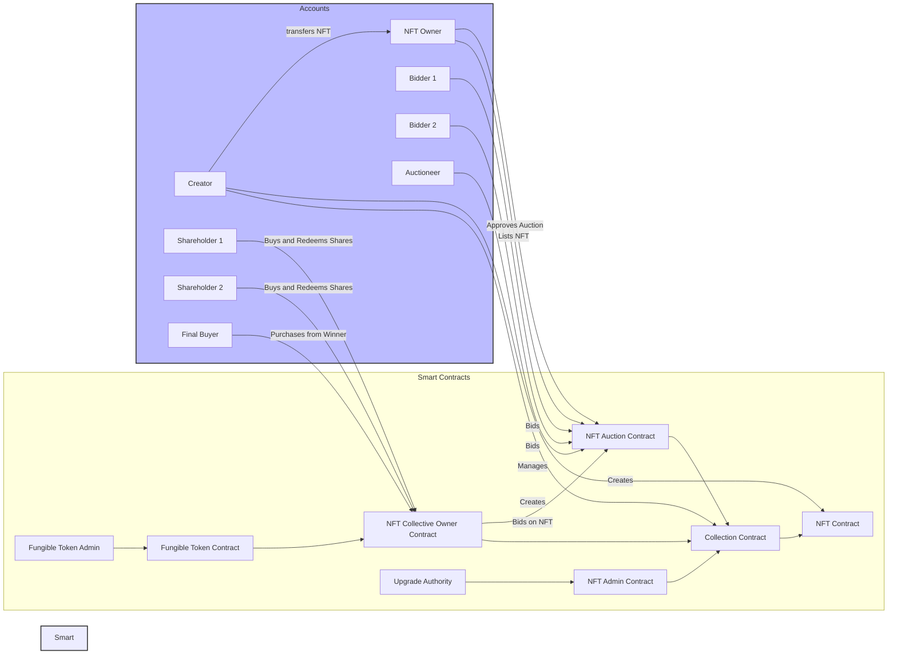

# NFT Standard

## Running Tests for NFT Standard

### Local network

```sh
yarn local:all
```

The test will take approximately 2 hours to complete on Mac M2 Max

### Lightnet network

```sh
zk lightnet start
yarn lightnet:all
```

The test will take approximately 7 hours to complete on Mac M2 Max

### Devnet network

```sh
yarn devnet:all
```

The test will take approximately one day to complete on Mac M2 Max. In case of the devnet node instability, some tests can fail and can be rerun by
`yarn devnet:auction:rerun`, setting the `RERUN` environment variable to the number of the test to rerun (1-16)
`yarn devnet:contract:matrix`
`yarn devnet:zkprogram:matrix`

## Environment

```sh
cp .env.example .env
```

Set the environment variables in the .env file for Pinata IPFS, getting the values from the pinata.cloud

```
PINATA_IPFS_GATEWAY=https://.....mypinata.cloud/ipfs/
PINATA_GATEWAY_TOKEN=gFu...
PINATA_JWT=eyJhb...
IPFS_PIN_URL=https://api.pinata.cloud/pinning/pinFileToIPFS
```

## Examples

### Auction example with the contract factory and collective ownership of the NFT

In legal terms, the auction is slitted to the several stages, each being the separate transaction on blockchain:

- Legally binding agreement to sell the NFT at the price not less than some price withing predefined time range
- Legally binding agreement to buy the NFT at the specific price
- Legally binding act that fixes the price and the winner of the auction
- Transfer of the NFT to the winner of the auction
- Transfer of the funds from the buyer to the seller
- Transfer of the commission to the auctioneer

#### The contracts

- Collection
- NFT
- NFT Admin
- NFT Auction
- NFT Collective Owner, issuing the shares to buy NFT and collecting the funds to buy the NFT
- Fungible Token, for issuing the shares
- Fungible Token Admin
- Upgrade Authority

Usual accounts involved:

- Creator of the Collection
- NFT owner that is putting the NFT on auction
- 2 bidders on the auction
- 2 shareholders that are buying the shares
- Auctioneer
- Final NFT buyer that will buy from the auction winner



#### Creation of the contract factory for the auction

The contracts cross-reference each other, therefore the factory is needed to create the contracts in the correct order, otherwise the compilation and the proving will fail.

```typescript
export function AuctionContractsFactory(params: {
  useAdvancedAdmin: boolean;
  approval: "auction" | "shares";
}) {
  const { useAdvancedAdmin, approval } = params;

  let Collection: ReturnType<typeof CollectionFactory>;
  let Approval: NFTApprovalContractConstructor;
  let Update: NFTUpdateContractConstructor;
  let Auction: ReturnType<typeof AuctionFactory>;
  let Admin = useAdvancedAdmin ? NFTAdvancedAdmin : NFTAdmin;
  let { NFTSharesAdmin, NFTSharesOwner, FungibleToken } = NFTSharesFactory({
    auctionContract: () => Auction,
  });

  function getCollection(): NFTCollectionContractConstructor {
    if (!Collection) {
      throw new Error("Collection constructor not set up yet!");
    }
    return Collection as unknown as NFTCollectionContractConstructor;
  }
  function getApproval(): NFTApprovalContractConstructor {
    if (!Approval) {
      throw new Error("Approval constructor not set up yet!");
    }
    return Approval as unknown as NFTApprovalContractConstructor;
  }
  function getUpdate(): NFTUpdateContractConstructor {
    if (!Update) {
      throw new Error("Update constructor not set up yet!");
    }
    return Update as unknown as NFTUpdateContractConstructor;
  }
  function getOwner(): NFTOwnerContractConstructor {
    if (!NFTSharesOwner) {
      throw new Error("Owner constructor not set up yet!");
    }
    return NFTSharesOwner as unknown as NFTOwnerContractConstructor;
  }

  Auction = AuctionFactory({
    collectionContract: getCollection,
  });

  Approval =
    approval === "auction"
      ? (Auction as unknown as NFTApprovalContractConstructor)
      : (NFTSharesOwner as unknown as NFTApprovalContractConstructor);

  Update = NFTStandardUpdate;

  Collection = CollectionFactory({
    adminContract: () => Admin as unknown as NFTAdminContractConstructor,
    ownerContract: getOwner,
    approvalContract: getApproval,
    updateContract: getUpdate,
  });

  return {
    Collection,
    Approval,
    Admin,
    NFTSharesAdmin,
    FungibleToken,
    NFTSharesOwner,
  };
}

const {
  Collection,
  Approval,
  Admin,
  NFTSharesAdmin,
  FungibleToken,
  NFTSharesOwner,
} = AuctionContractsFactory({
  useAdvancedAdmin,
  approval: "auction",
});
```

#### The auction steps

1. The contract factory is created
2. All contract are compiled
3. UpgradeAuthority is deployed in case when AdvancedAdmin is used
4. Collection and Admin are deployed
5. NFT is minted by the creator of the Collection
6. NFT is transferred to the first NFT owner by the creator of the Collection
7. NFT is put on auction by the first NFT owner by deploying the Auction contract and approving the Auction contract to transfer the NFT, minimum price is set to 10 MINA
8. NFT Collective Owner is deployed that is authorized to buy the NFT from the auction for max 25 MINA and then sells the NFT for 30 MINA. In the same tx, FungibleToken and FungibleTokenAdmin are deployed
9. Two shareholders are buying the shares of the NFT Collective Owner for 10 MINA each. The shares are FungibleTokens transferred to the shareholders in consideration of 10 MINA each
10. Bidder 1 is bidding on the NFT for 15 MINA
11. NFT Collective Owner is bidding for 17 MINA, 15 MINA is returned to the bidder 1. Any user that owns at least 25% of the shares can bid on the NFT, with price being lower than the max buy price set as 25 MINA.
12. Bidder 2 is bidding for 18 MINA, 17 MINA is returned to the NFT Collective Owner
13. NFT Collective Owner is bidding for 20 MINA, 17 MINA is returned to the bidder 2
14. Everyone is waiting for the end of the auction, no new bids are received
15. Auction is settled by setting the flag in the Auction contract state that the auction is settled and transferring the NFT to the highest bidder in atomic transaction involving the Auction, NFT, NFT Admin, Collection (total 5 AccountUpdates with proof authorizations, 2 for Auction to make the transaction atomic)
16. The payment is made from Auction to the first NFT owner
17. The payment is made from the Auction to the auctioneer (commission)
18. Some times passes, the NFT is always offered for sale by the NFT Collective Owner at the price of 30 MINA
19. Final buyer is buying the NFT from the NFT Collective Owner for 30 MINA
20. Shareholders are redeeming their shares for the FungibleTokens, receiving 15 MINA each, and having the profit of 5 MINA each

#### The auction steps - failed auction

In case the NFT cannot be transferred for any reason (it can be the NFT Admin contract prohibiting the transfer to the auction winner due to the KYC status of the auction winner), the parties can withdraw the NFT and the payment from the Auction to the NFT owner and the bidder after the expiry of WITHDRAW_PERIOD. Therefore, it is important to settle the auction within the WITHDRAW_PERIOD.

### Game example

The game is a simple game of guessing the 7 numbers that represent the hex number of the colors encoded in the phrase "Richard Of York Gave Battle In Vain"

The player can update the metadata of his NFT to put the number of colors he guessed right. The first ANY player to guess all 7 colors wins the game and can claim the NFT.

#### The steps

1. Default contract factory is used:

```typescript
const { Collection } = NonFungibleTokenContractsFactory({
  adminContract: NFTAdmin,
  updateFactory: () => ColorGame,
});
```

2. Contracts are compiled
3. Collection and NFT admin are deployed
4. NFT is minted by the creator of the Collection, setting

- the owner to first player
- canChangeMetadata to true
- canChangeStorage to true
- canChangeOwnerByProof to true
- canTransfer to true

5. First player is playing the game, guessing 4 colors right
6. The NFT is updated by the first player to put the number of colors he guessed right and the highest color - indigo by creating a proof with Zkprogram updating the NFT metadata. During the update, the proof public output is checked against the game contract state to ensure that the score, owner and the highest color are updated correctly.
7. The second player is playing the game, guessing 7 colors right
8. The NFT is updated by the second player (who is the winner and NOT owner of the NFT) to put the number of colors he guessed right and the highest color - violet by creating a proof with Zkprogram updating the NFT metadata. During the update, the proof public output is checked against the game contract state to ensure that the score, owner and the highest color are updated correctly. This update includes the transfer of the NFT to the second player.
